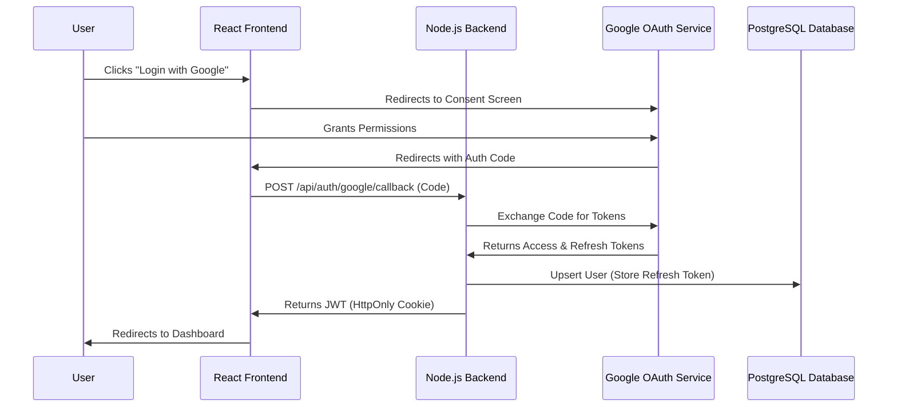

# Authentication Sequence Diagram (Mermaid)

```mermaid
sequenceDiagram
    participant User
    participant Client as React Frontend
    participant Server as Node.js Backend
    participant Google as Google OAuth Service
    participant DB as PostgreSQL Database

    User->>Client: Clicks "Login with Google"
    Client->>Google: Redirects to Consent Screen
    User->>Google: Grants Permissions
    Google->>Client: Redirects with Auth Code
    Client->>Server: POST /api/auth/google/callback (Code)
    Server->>Google: Exchange Code for Tokens
    Google->>Server: Returns Access & Refresh Tokens
    Server->>DB: Upsert User (Store Refresh Token)
    Server->>Client: Returns JWT (HttpOnly Cookie)
    Client->>User: Redirects to Dashboard
```
