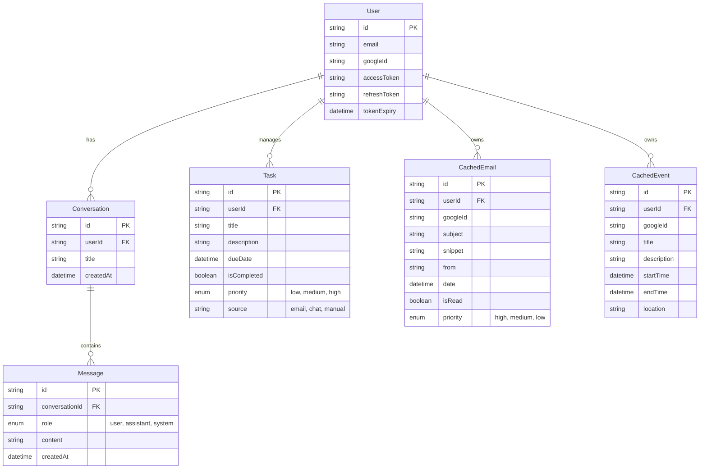

# Database Schema Diagram (Mermaid)

```mermaid
erDiagram
    User ||--o{ Conversation : has
    User ||--o{ Task : manages
    User ||--o{ CachedEmail : owns
    User ||--o{ CachedEvent : owns
    Conversation ||--o{ Message : contains

    User {
        string id PK
        string email
        string googleId
        string accessToken
        string refreshToken
        datetime tokenExpiry
    }

    Conversation {
        string id PK
        string userId FK
        string title
        datetime createdAt
    }

    Message {
        string id PK
        string conversationId FK
        enum role "user, assistant, system"
        string content
        datetime createdAt
    }

    Task {
        string id PK
        string userId FK
        string title
        string description
        datetime dueDate
        boolean isCompleted
        enum priority "low, medium, high"
        string source "email, chat, manual"
    }

    CachedEmail {
        string id PK
        string userId FK
        string googleId
        string subject
        string snippet
        string from
        datetime date
        boolean isRead
        enum priority "high, medium, low"
    }

    CachedEvent {
        string id PK
        string userId FK
        string googleId
        string title
        string description
        datetime startTime
        datetime endTime
        string location
    }
```
